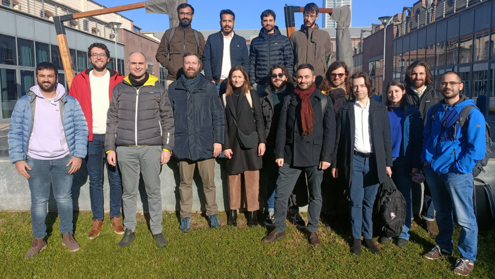

## Welcome to our group!
The multi-Scale ModeLing Laboratory - SMaLL - is an engineering research group launched at [Politecnico di Torino](https://www.polito.it/) with the aim to propose and promote innovative solutions for applications related to the energy sector. The lab is led and composed of young researchers with different backgrounds in engineering, mathematics and physics.

Our activities span over modeling, numerical simulations and experimental tests, mostly focusing on sea water desalination and purification using solar energy and waste heat recovery. We work on materials modeling techniques at different scales (from atomistic to continuum), model-order reduction techniques, coarse-graining (up-scaling) methods for colloidal suspensions for bio/nano-technologies, energetic efficiency and more. Check out our [research](https://small.polito.it/research.html) and [projects](https://small.polito.it/projects.html)!

## Contact us
[Prof. Eliodoro Chiavazzo](http://www.eliodorochiavazzo.net/)

Department of Energy || 
Politecnico di Torino || 
Corso Duca degli Abruzzi 24 || 
10129 Turin - Italy
 
Mail: [eliodoro.chiavazzo@polito.it](mailto:eliodoro.chiavazzo@polito.it) || 
Phone: +39 011 090 4557 || 
Fax: +39 011 090 4499

## Follow us

<!--
**SMaLL-PoliTo/SMaLL-PoliTo** is a ✨ _special_ ✨ repository because its `README.md` (this file) appears on your GitHub profile.

Here are some ideas to get you started:

- 🔭 I’m currently working on ...
- 🌱 I’m currently learning ...
- 👯 I’m looking to collaborate on ...
- 🤔 I’m looking for help with ...
- 💬 Ask me about ...
- 📫 How to reach me: ...
- 😄 Pronouns: ...
- ⚡ Fun fact: ...
-->
